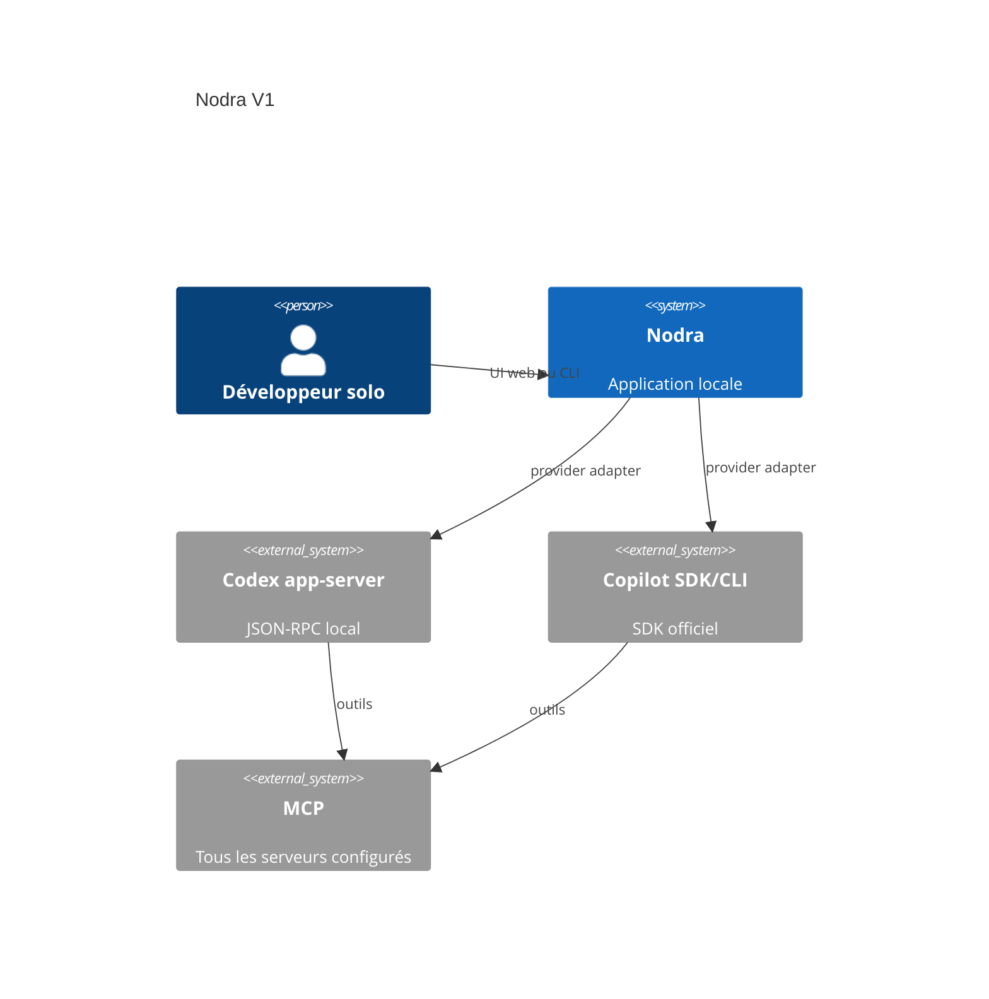
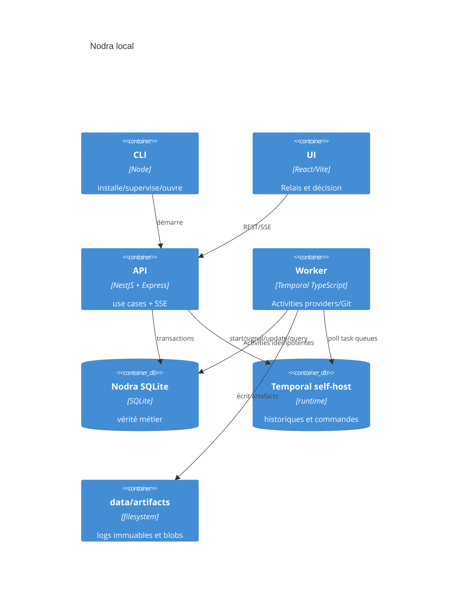
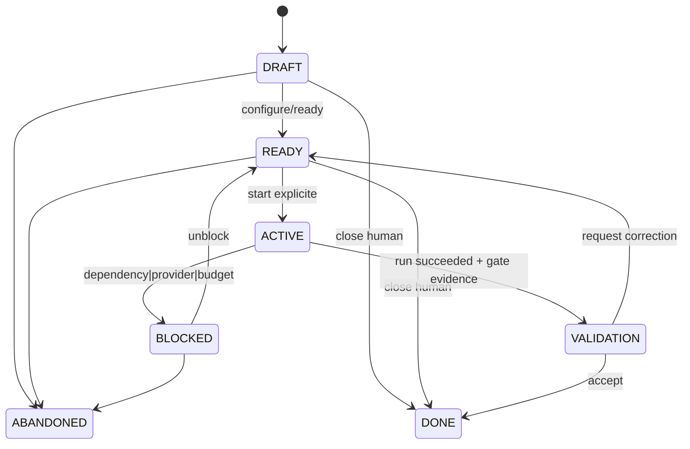

# 01 — Architecture système, modules et états

## C4





## Modules hexagonaux

| Module | Responsabilité | Dépendances autorisées |
| --- | --- | --- |
| `domain` | agrégats, invariants, state machines, événements métier | zéro framework/I/O |
| `application` | use cases, transactions, authorisation, ports | domain + ports |
| `adapters/in` | Nest REST/SSE, CLI | application uniquement |
| `adapters/out/sqlite` | repositories, outbox, schema Drizzle, migrations générées | ports + Drizzle + driver SQLite |
| `adapters/out/temporal` | client/worker/workflow | ports + SDK Temporal |
| `adapters/out/providers` | Codex app-server, Copilot SDK | ports + SDK/protocole |
| `adapters/out/git,fs,process` | Git, worktree, observations, artefacts | ports + OS |

Les Workflows Temporal ne contiennent pas d'I/O ni de règle métier persistée. Ils attendent, coordonnent et appellent des Activities; toute écriture SQLite, provider, Git ou fichier est une Activity idempotente.

Drizzle ORM est confiné à `adapters/out/sqlite`. Son schéma TypeScript strict est la source d'implémentation; domaine et application n'importent ni Drizzle ni types SQL. Les repositories traduisent ports ↔ Drizzle. Le SQL manuel est réservé aux PRAGMA/bootstrap, FTS5, triggers, contraintes et index SQLite que Drizzle ne représente pas correctement; il est versionné, revu et couvert par le contrat DDL de [02-domain-sqlite.md](02-domain-sqlite.md).

## Interfaces normatives

```ts
type Id = string & { readonly brand: unique symbol };
type MissionState = 'DRAFT'|'READY'|'ACTIVE'|'BLOCKED'|'VALIDATION'|'DONE'|'ABANDONED';
type RunState = 'QUEUED'|'STARTING'|'RUNNING'|'WAITING_APPROVAL'|'CANCELLING'|'SUCCEEDED'|'FAILED'|'CANCELLED'|'UNKNOWN';
interface CommandContext { commandId: Id; actor: 'user'|'manager'; occurredAt: string; }
interface MissionRepository { load(id: Id): Promise<Mission>; save(m: Mission, expectedVersion: number): Promise<void>; }
interface WorkflowPort { start(input: StartMissionInput): Promise<{workflowId:string; runId:string}>; signal(id:string, signal: WorkflowSignal): Promise<void>; update<T>(id:string, update:WorkflowUpdate): Promise<T>; query<T>(id:string, q:WorkflowQuery): Promise<T>; }
interface ProviderPort { capabilities(): Promise<ProviderCapabilities>; start(input: ProviderStart): Promise<ProviderRef>; events(ref:ProviderRef): AsyncIterable<ProviderEvent>; steer(ref:ProviderRef, text:string, mode:'immediate'|'enqueue'): Promise<void>; cancel(ref:ProviderRef): Promise<void>; resume(ref:ProviderRef): Promise<ProviderRef>; }
```

## Machines à états



Invariants : aucun lancement à la lecture; `DONE` agent nécessite acceptation; `ACTIVE` implique au plus un run actif par mission; une dépendance non satisfaite interdit le start; une suppression exige confirmation et cible exacte.
