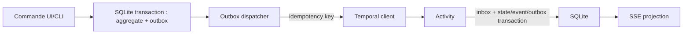

# 05 — Cohérence SQLite / Temporal et preuves

## Règle de vérité

SQLite répond aux écrans, décisions, policies, audit métier et relations métier. Temporal exécute les commandes durables et garde son historique. L'outbox est technique et ne remplace pas `business_audit_event`. Aucun composant ne fait une double écriture atomique impossible SQLite+Temporal.

Protocole : (1) le use case résout/valide la configuration, écrit `run`, `run_config_snapshot`, lignes MCP/attachments, décision et `outbox` dans **la même** transaction; (2) dispatcher relit les messages non publiés et commence/signale/met à jour Temporal avec `dedupe_key`; (3) succès marque `published_at`; (4) Activity applique l'observation avec `inbox`; (5) reconciliation périodique compare `run.temporal_workflow_id` à Query/Describe et crée une alerte, jamais une mutation silencieuse. `StartWorkflow` est idempotent par workflowId; les Signals/Updates portent `commandId` et le Workflow ignore les doublons. La preview utilise le même résolveur mais n'écrit rien.

Crash : après SQLite avant Temporal, outbox reprend; après Temporal avant `published_at`, start/signal est rejoué sans effet métier en double; après effet externe avant SQLite, Activity rejouée consulte son journal d'idempotence/provider/Git et produit `UNKNOWN` + décision si elle ne peut pas établir le résultat.

## Modèle de preuve anti-périmée

`evidence` est immuable et attachée à un run/attempt. Une validation ne porte que sur une preuve complète et non périmée :

| Champ obligatoire | Valeur |
| --- | --- |
| identité | `runId`, `missionId`, `attempt`, `collectorId`, `collectorVersion` |
| commande | argv normalisé (liste, sans shell), `cwd` canonique, environnement redacted |
| Git | `headBefore`, `treeBefore`, `headAfter`, `treeAfter`, diff digest |
| exécution | `startedAt`, `endedAt`, `exitCode`, signal, timeout, `stdoutSha256`, `stderrSha256` |
| artefact | path relatif au data root, MIME, taille, `sha256`, schéma |
| validation | policy version, statut, validator humain, date, justification |

La validité exige : même run, `cwd` dans workspace prévu, collector connu, timestamps cohérents, digests accessibles, et `treeAfter` identique à la cible de gate ou approbation explicite d'obsolescence. Toute modification Git postérieure rend une preuve dépendante `stale`; elle reste historisée, mais ne satisfait plus la gate. Les déclarations agent sont une catégorie séparée et n'ont aucune valeur de gate seules.
